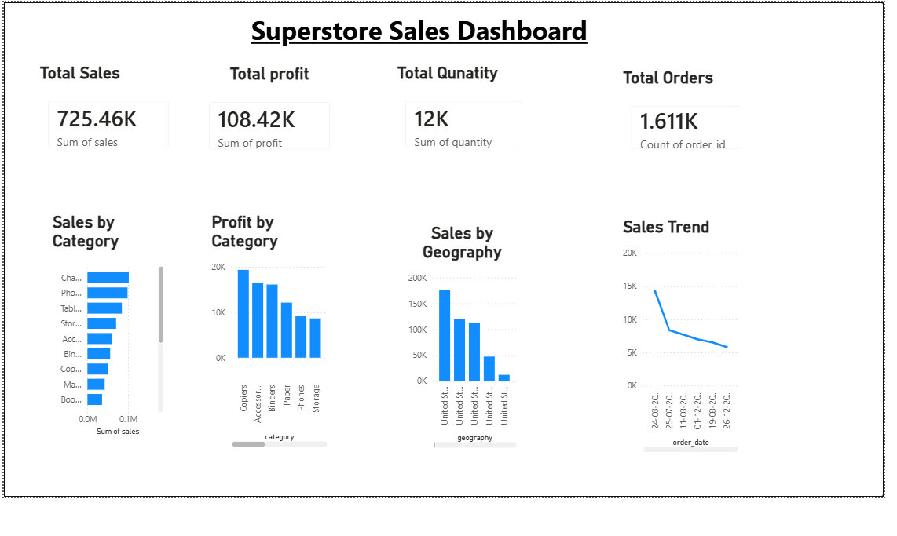
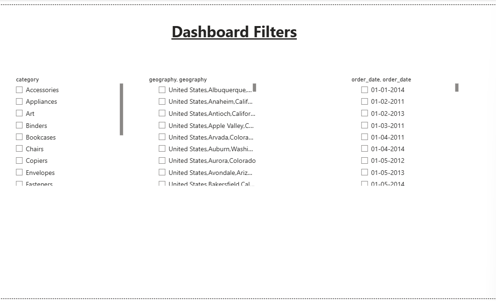

# 📊 Superstore Sales Dashboard (Power BI + MySQL)

#📌Project Overview

This project is an interactive **Sales Dashboard** developed using **Power BI** and **MySQL**. The dashboard helps analyze sales performance through key performance indicators (KPIs) and visual reports, enabling better business decision-making.

---

## 🛠️ Tools & Technologies

- Power BI Desktop
- MySQL
- SQL
- Data Visualization

---

## 📈 Dashboard Features

- 💰 Total Sales
- 💵 Total Profit
- 📦 Total Quantity Sold
- 🛒 Total Orders
- 📊 Sales by Category
- 📈 Profit by Category
- 🌍 Sales by Geography
- 📉 Sales Trend
- 🎛️ Interactive Dashboard Filters

---

## 📸 Dashboard Preview

### Main Dashboard

### Dashboard Filters

---

## 📂 Project Files

- `Superstore_Sales_Analytics.pbix` – Power BI dashboard
- `dashboard_page1.png` – Dashboard screenshot
- `dashboard_page2.png` – Filters page screenshot
- `superstore.csv` *(optional)* – Dataset

---

## 📊 Key Insights

- Identified top-performing product categories based on sales.
- Compared profit across different product categories.
- Analyzed sales performance across geographical locations.
- Monitored sales trends over time.
- Displayed business KPIs including Total Sales, Profit, Quantity, and Orders.

---

# Skills Demonstrated

- Power BI Dashboard Development
- Data Visualization
- SQL & MySQL
- KPI Reporting
- Business Analytics
- Data Analysis

---

## Author

**Kenche Vishwanath Hari**

- LinkedIn: https://www.linkedin.com/in/vishwanath-hari-kenche-677979316
- GitHub: https://github.com/vishwanathHarikenche

---

⭐ If you found this project interesting, feel free to explore the dashboard and provide feedback!